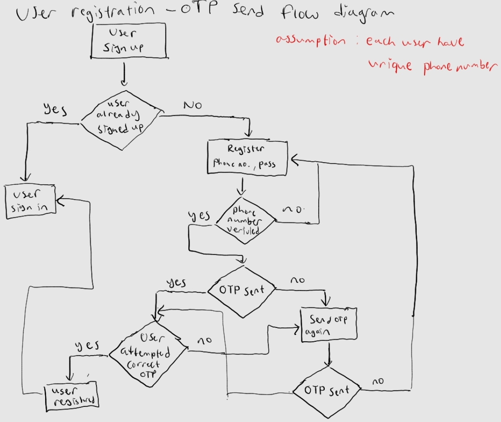

# This is the docs of this API

This API focus on sending OTP to new registered user.
The User model consist of unique ID (automatically generated), phone number (unique for each users), and password.

Technology:
- Golang Fiber
- Postgre / MongoDB (still experimentng)
- Twilio for OTP send helper (still experimenting)
- FrontEnd on another repo for user form (optional)

The OTP planned to be sent with Twilio (still working on it)

The OTP intended to be saved temporarily in some kind of cache like Redis, but for this project, maybe I will try the database first.

## Flow of The Process
For every registration process, if user already registered or already exist (the phone number is in the database), than redirect user to the login page.

If user not yet registered, user can enter the phone number and password in the registration form field.
in the front end we do the following validation:
- phone number must be started with +62
- password must be minimum 8 character long consist lowercase letter, UPPERCASE letter, and numerical integers.

If the validation in the front end success, user can ask for OTP request (user still in same page as before, in registration form field). If OTP verified in the backend, OTP sent to the user.
- If user received the OTP, user can enter it to the newly OTP form field.
- If user did not received the OTP after waiting for certain time, say 2 minutes, user can ask for OTP request again. For security reasons, user can send OTP to the same number for only 5 times a day.

Now, assume the user received the OTP.
- If the user entered correct OTP, then the phone number and password entered before will be saved in the database and user can be redirected to the login page.
- If the user entered incorrect OTP after several trial, say 3 times, user can wait for another certain time, say 5 minutes to ask for another OTP request (with the same number or other number).

#### Flow Diagram of The OTP Sending Process

## Project Structure
I made several abstraction layer of the project to separate distinct feature, handler, helper, or model. This separation intended to make our life easier :) according to clean code and SOLID principles.
- main.go is the entry point of the API program
- config consist of configurations utility to process .env 
- database, responsible to make connection utitlity and model the database
- middleware, intended to make user validation, still working on it.
- model, the user model/schema.
- router, routes intialization and maps path / routes to specific function.
- schema, consist of authentication and request/response schema (abstracting the payload)
- util, the  handler and helper function to help us verify, send otp, routing, login , reusable queries, and many more functions.
- .env, contains environment variables, such as the database user.